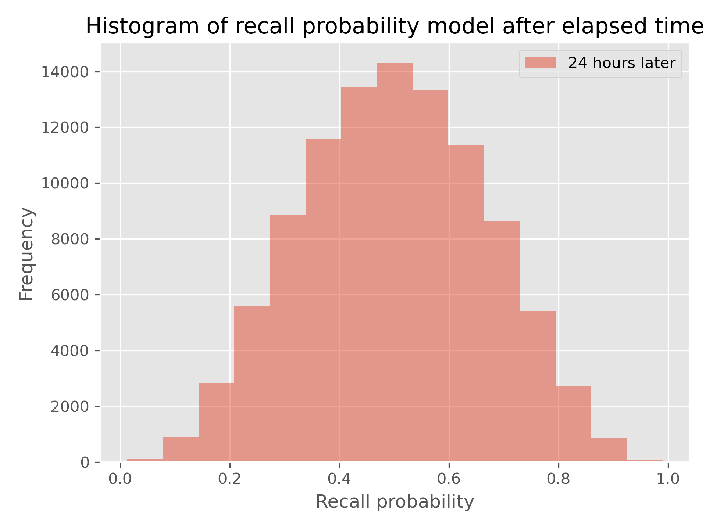
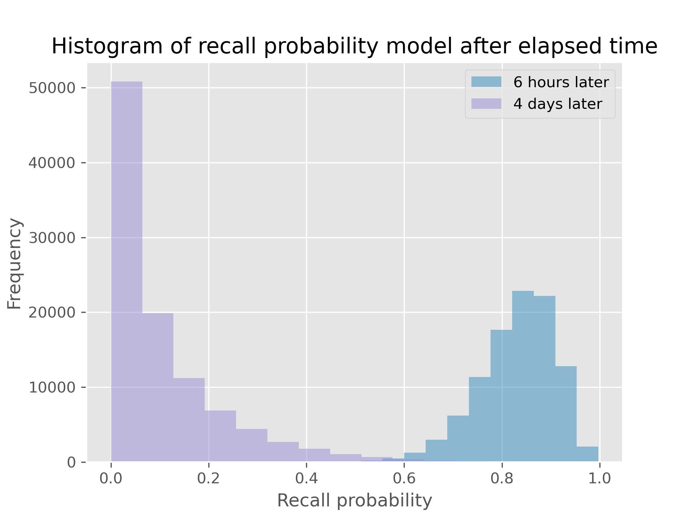
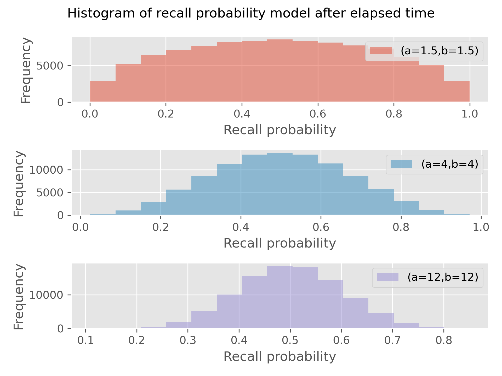

# Ebisu.js 2.1

This is a TypeScript/JavaScript port of the original Python implementation of [Ebisu](https://github.com/fasiha/ebisu), a public-domain library intended for use by quiz apps to intelligently handle scheduling. See [Ebisu’s literate documentation](https://github.com/fasiha/ebisu) for *all* the details! This document just contains a quick guide to how things work for browser and Node.js.

**Table of contents**
- [Ebisu.js 2.1](#ebisujs-21)
  - [Install](#install)
  - [API howto](#api-howto)
    - [Memory model](#memory-model)
    - [Predict current recall probability: `ebisu.predictRecall`](#predict-current-recall-probability-ebisupredictrecall)
    - [Update a recall probability model given a quiz result: `ebisu.updateRecall`](#update-a-recall-probability-model-given-a-quiz-result-ebisuupdaterecall)
    - [Model to halflife: `ebisu.modelToPercentileDecay`](#model-to-halflife-ebisumodeltopercentiledecay)
    - [Manual halflife override: `ebisu.rescaleHalflife`](#manual-halflife-override-ebisurescalehalflife)
    - [API summary](#api-summary)
  - [Building](#building)
  - [Changelog](#changelog)
  - [Acknowledgements](#acknowledgements)

## Install

As always, we support both Node.js (CommonJS/`require` as well as ES modules/`import`) and browser (ES modules/`import` as well as IIFE for `<script>`).

**Node.js** First,
```
$ npm install --save ebisu-js
```
Then, in your code, if you use CommonJS and `require`, simply:
```js
var ebisu = require('ebisu-js');
```

If you use ES modules and `import`, do this instead:
```js
import * as ebisu from 'ebisu-js';
```
If you use TypeScript, the above will just work.

**Browser** Make [`ebisu.min.js`](./dist/ebisu.min.js) available on your webserver and load it in a `script` tag (5.6 KB uncompressed, 3 KB after gzip), then in your HTML:
```html
<script type="text/javascript" src="ebisu.min.js"></script>
```
This makes the `ebisu` object available in the top-level. (I also recommend you include the [sourcemap](./dist/ebisu.min.js.map) to help debugging in the browser.)

If you want to avoid polluting your global namespace with this variable, you can use the minified ES module: make [`ebisu.min.mjs`](./dist/ebisu.min.mjs) available on your webserver (and ideally its [sourcemap](./dist/ebisu.min.mjs.map)), and in your HTML:
```html
<script type="module">
    import * as ebisu from './ebisu.min.mjs';
</script>
```

The above files are ES6+ and support modern browsers, only because I'm lazy and ESbuild only supports ES6+. If you need to support older browsers, please [get in touch](https://github.com/fasiha/ebisu.js/issues) and I'll be happy to make an ES5-compatible build.

## API howto

Let’s start working immediately with code and we’ll explain as we go.

### Memory model

It’s important to know that Ebisu is a very narrowly-scoped library: it aims to answer just two questions:
- given a set of facts that a student is learning, which is the most (or least) likely to be forgotten?
- After the student is quizzed on one of these facts, how does the result get incorporated into Ebisu’s model of that fact’s memory strength?

Ebisu doesn’t concern itself with what these facts are, what they mean, nor does it handle *storing* the results of reviews. The external quiz app, at a minimum, stores a probability *model* with each fact’s memory strength, and it is this *model* that Ebisu transforms into predictions about recall probability or into *new* models after a quiz occurs.

Create a *default* model to assign newly-learned facts:
```js
var defaultModel = ebisu.defaultModel(24);
// Also ok: `ebisu.defaultModel(24, 4)` or even `ebisu.defaultModel(24, 4, 4)`.
console.log(defaultModel);
```
This returns a three-element array of numbers: we’ll call them `[a, b, t]`.

These three numbers describe the probability distribution on a fact’s recall probability. Specifically, they say that, `24` hours after review, we believe this fact’s recall probability will have a `Beta(a, b) = Beta(4, 4)` distribution, whose histogram looks like this, for a hundred thousand samples:



The above distribution only applies 24 hours after learning the fact. Ebisu can transform this distribution given any time horizon though. That is, given you think the recall probability follows `Beta(4, 4)` a day after a fact is learned, here are the recall probability after just six hours, and after four days:



You can also tune `a` and `b` via `defaultModel`, i.e., `ebisu.defaultModel(24, 4)` will explicitly initialize `a` and `b` to 4. In words, the lower the `a=b`, the less sure you are that `t=24` is the halflife. In pictures, here are the histograms for 1.5, 4, and 12:



I recommend using `a=b` around 2-4: this is loose and allows the quiz data to aggressively guide the scheduling. You don't want to go lower than 1 because `a=b=1` is the flat distribution: you have no confidence that 24 hours is the halflife, and the math gets weird.

> We use the [Beta distribution](https://en.wikipedia.org/wiki/Beta_distribution), and not some other probability distribution on numbers between 0 and 1, for [statistical reasons](https://en.wikipedia.org/wiki/Conjugate_prior) that are indicated in depth in the [Ebisu math](https://fasiha.github.io/ebisu/#bernoulli-quizzes) writeup.

This should give you some insight into what those three numbers, `[4, 4, 24]` mean, and why you might want to customize them—you might want the half-life to be just two hours instead of a whole day, in which case you’d set `defaultModel` to `ebisu.defaultModel(2)`.

### Predict current recall probability: `ebisu.predictRecall`

Given a set of models for facts that the student has learned, you can ask Ebisu to predict each fact’s recall probability by passing in its model and the currently elapsed time since that fact was last reviewed or quizzed via `ebisu.predictRecall`:
```js
var model = ebisu.defaultModel(24);
var elapsed = 1; // hours elapsed since the fact was last seen
var predictedRecall = ebisu.predictRecall(model, elapsed, true);
console.log(predictedRecall);
```
This function efficiently calculates the *mean* of the histogram of recall probabilities in the interactive demo above (but it uses math, not histograms!). It's a bit faster if you let the third argument be `false`, in which case this function returns *log*-probabilities.

In either case, a quiz app can call this function on each fact to find which fact is most in danger of being forgotten—that’s the one with the lowest predicted recall probability.

### Update a recall probability model given a quiz result: `ebisu.updateRecall`

Suppose your quiz app has chosen a fact to review, and tests the student. It's time to update the model with the quiz results. Ebisu supports a rich set of quiz types:
1. of course we support the binary quiz, i.e., pass/fail.
2. We also support Duolingo-style quizzes where the student gets, e.g., 2 points out of a max of 3. This is called the binomial case (and of course plain binary quizzes are a special case of the binomial with a max of 1 point).
3. The most complex quiz type we support is called the noisy-binary quiz and lets you separate the actual quiz result (a pass/fail) with whether the student *actually* remembers the fact, by specifying two independent numbers:
   1. `Probability(passed quiz | actually remembers)`, or $q_1$ in the derivation below, is the probability that, assuming the student *actually* remembers the fact, they got the quiz right? This should be 1.0 (100%), especially if your app is nice and lets students change their grade (typos, etc.), but might be less if your app doesn’t allow this. Second, you can specify
   2. `Probability(passed quiz | actually forgot)`, or $q_0$ that is, given the student actually forgot the fact, what’s the probability they passed the quiz? This might be greater than zero if, for example, you provided multiple-choice quizzes and the student only remembered the answer because they recognized it in the list of choices. Or consider a foreign language reader app where users can read texts and click on words they don’t remember: imagine they read a sentence without clicking on any words—you’d like to be able to model the situation where, if you actually quizzed them on one of the words, they would fail the quiz, but all you know is they didn’t click on a word to see its definition.

The `updateRecall` function handles all these cases. It wants an Ebisu model (output by `defaultModel` for example), the number of `successes` out of `total` points, and the time `elapsed`. Let's illustrate the simple binary case here:
```js
var model = ebisu.defaultModel(24);
var successes = 1;
var total = 1;
var elapsed = 10;
var newModel = ebisu.updateRecall(model, successes, total, elapsed);
console.log(newModel);
```
The new model is a new 3-array with a new `[a, b, t]`. The Bayesian update magic happens inside here: see here for [the gory math details](https://fasiha.github.io/ebisu/#updating-the-posterior-with-quiz-results).

For the plain binary and binomial cases, `successes` is an integer between 0 and `total` (inclusive).

For the noisy-binary case, `total` must be 1 and `successes` can be a float going from 0 to 1 (inclusive).
- If `successes < 0.5`, the quiz is taken as a failure, whereas if `successes > 0.5`, it's taken as a success.
- `Probability(passed quiz | actually remembers)` is called `q1` in the Ebisu [math derivation](https://fasiha.github.io/ebisu/#bonus-soft-binary-quizzes) and is taken to be `max(successes, 1-successes)`. That is, if `successes` is =0.1 or 0.9, this conditional probability `q1` is the same, 0.9.
- The other probability `Probability(passed quiz | actually forgot)` is called `q0` in the Ebisu derivation and defaults to `1-q1`, but can be customized: it's passed in as another argument after the elapsed time.

The following code snippet illustrates how to use the default `q0` and how to specify it:
```js
var model = ebisu.defaultModel(24);
var successes = 0.95;
var total = 1;
var elapsed = 96;
var updated1 = ebisu.updateRecall(model, successes, total, elapsed); // default q0

var q0 = 0.2;
var updated2 = ebisu.updateRecall(model, successes, total, elapsed, q0);

// compare halflives of these two cases
console.log([updated1, updated2].map(m => ebisu.modelToPercentileDecay(m)))
// [ 34.76462629898456, 28.024103424692004 ]
```
Both updates model a successful quiz with `q1` = 0.95. But the first defaulted  `q0` to the complement of `q1`, i.e., 0.05, as plausible. The second explicitly set a higher `q0`. The result can be seen in the halflife of the resultant models: 35 hours versus 28 hours.

This code snippet also illustrates another function in the API, which we look at next.

### Model to halflife: `ebisu.modelToPercentileDecay`
Sometimes it's useful to convert an Ebisu model (an `[a, b, t]` array) into the halflife it represents. We did this above to compare the result of choosing different `q0` for the soft-binary case. `ebisu.modelToPercentileDecay` accepts a model and optionally a percentile, and uses a golden section root finder to find the time needed for the model's recall probability to decay to that percentile:
```js
var model = ebisu.defaultModel(24);
console.log(ebisu.modelToPercentileDecay(model)); // 23.999553931988203
console.log(ebisu.modelToPercentileDecay(model, 0.1)); // 99.331489589545
console.log(ebisu.modelToPercentileDecay(model, 0.9)); // 3.375025317798656
```

### Manual halflife override: `ebisu.rescaleHalflife`
It happens. You initialized a model and you updated it with some quizzes, but your initial halflife was wrong. Your student tells your quiz app that it's just not the right halflife, and they want to see this fact more or less frequently. Ebisu gives you a function to accurately deal with this: `ebisu.rescaleHalflife` takes an `[a, b, t]` model and a `scale` argument, a positive number, and returns a new model with the same probability distribution on recall probability but scaled to `t * scale`.

The following two code snippets let you say "I want to see this fact twice as often" versus "I'm seeing this fact ten times too often":
```js
var model = ebisu.defaultModel(24);

// I forgot this fact! Its halflife is half what I thought:
var newModel = ebisu.rescaleHalflife(model, 0.5);

// I know this fact! Its halflife is ten times what you think
var newModel2 = ebisu.rescaleHalflife(model, 10);
```

### API summary

That’s it! That’s the entire API:
- `ebisu.defaultModel(t: number, a = 4.0, b = a): Model` if you can’t bother to create a 3-array (a `Model`). The units of `t` are the units of all other time inputs—you decide if you want to deal with hours, days, etc.
- `ebisu.predictRecall(prior: Model, tnow: number, exact = false): number` returns the recall log-probability given a model and the time elapsed since the last review or quiz. If `exact`, you get linear probability (between 0 and 1) instead of log-probability (-∞ to 0).
- `ebisu.updateRecall(prior: Model, successes: number, total: number, tnow: number, q0?: number): Model` to update the model after a quiz session with `successes` out of `total` statistically-independent trials exercising the fact, and time after its last review. See above for the noisy-binary case where `0 <= successes <= 1` is a float and optionally `q0`. Returns a new model.

Two bonus functions:
- `ebisu.modelToPercentileDecay(model: Model, percentile = 0.5, tolerance = 1e-4): number` to find the half-life (time for recall probability to decay to 50%), or actually, any percentile-life (time for recall probability to decay to any percentile). `tolerance` tunes how accurate you want the result to be.
- `ebisu.rescaleHalflife(prior: Model, scale = 1): Model` will return a new `Model` with the halflife scaled by `scale`.

## Building

This is a TypeScript library. For a one-shot compile, run `npm run compile`. You can also run the TypeScript compiler in watch mode with `npm run compile-watch`.

We use `tape` for tests: after compiling, run `npm test`. This consumes `test.json`, which came from the [Ebisu Python reference implementation](https://fasiha.github.io/ebisu/).

We use ESbuild to create CommonJS (for Node `require`), ES modules (for Node and browsers' `import`), and an IIFE (for browsers' `<script>` tag). `npm run build` will generate all three.

## Changelog
The version of this repo matches the Python reference’s version up to minor rev (i.e., Python Ebisu 1.0.x will match Ebisu.js 1.0.y). See the Python Ebisu [changelog](https://github.com/fasiha/ebisu/blob/gh-pages/CHANGELOG.md).

This JavaScript port is version 2.1, which as of now (Feb 2023) is the latest Python Ebisu release adding soft-binary quizzes, `rescaleHalflife`, and changes to `updateRecall` so that it always rebalances.

**2.1.3** Allow you to pass in `tolerance` into `updateRecall` for extremely unbalanced cases. Reducing this from the default 1e-8 to 1e-6 or 1e-4 might make `updateRecall` work when it otherwise didn't. The `tolerance` is passed into [`minimize-golden-section-1d`](https://github.com/scijs/minimize-golden-section-1d), which iterates until `Math.abs(previousAlphaBeta - nextAlphaBeta) < tolerance`. See https://github.com/fasiha/ebisu.js/issues/20.

**2.1.2 and 2.1.1** Internal improvements to detect divergence of the Gamma function when elapsed time is significantly greater than halflife. In this situation, we retry the calculation in the log domain. See https://github.com/fasiha/ebisu.js/pull/24 and https://github.com/fasiha/ebisu.js/pull/21 respectively.

## Acknowledgements

I use [gamma.js](https://github.com/substack/gamma.js), one of substack’s very lightweight and very useful modules.

We also use this fine [golden section minimization](https://github.com/scijs/minimize-golden-section-1d) routine from the wonderful Scijs package.

I’m super-grateful for, and happily acknowledge, the hard work of Athan Reines and collaborators on [Stdlib.js](https://github.com/stdlib-js/stdlib), which promises to be the math library JavaScript so badly needs. It is used here only for testing purposes but I can recommend it.

